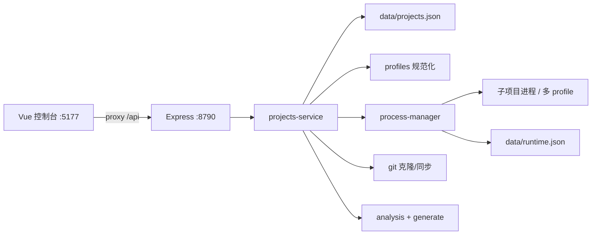

# LabHub · 项目分析总结

> 生成日期：2026-09-10
> 分析根目录：`E:\Desktop\TYX\AI\labhub`
> 说明：基于仓库内文件与脚本整理；推断处已标明。

## 1. 一句话定位

LabHub 是本机**多 Git 仓库控制中枢**：按地址拉取/挂载项目，按「启动模式」分端启停与看日志，支持构建目标与研发分期，并在控制台阅读（或自动生成）各仓《项目分析总结》；子项目仍用各自 `origin` 提交推送。

## 2. 项目概览

| 项 | 内容 |
|---|---|
| 类型 | npm workspaces 全栈（管理 API + Vue 控制台） |
| 主要语言 | TypeScript |
| 包管理器 | npm（workspaces + `package-lock.json`） |
| 当前分支 / 版本线索 | `main`；根包 `0.1.0` |
| 许可证 | 未在仓库体现 |

### 2.1 目标与范围

- 要解决的问题：在一台机器上统管多个独立 Git 项目，避免把「中枢」嵌进某个业务仓内部。
- 明确不做的事：不替代子项目 git 工作流；不做云端托管/多租户；默认无鉴权（仅适合受信本机）；LabHub 重启后**不会**自动拉起托管项目。

### 2.2 使用者与场景

- 目标用户：本机开发者、实验环境维护者。
- 典型场景：登记仓库 → 配置多端启动/构建模式与分期 → 控制台按模式启停 → 看日志与运行地址 → 读或再生成分析总结。

## 3. 我能用这个项目做什么

> 本节回答：作为使用者，跑起来之后能得到什么结果。

| # | 我可以… | 得到的结果 | 依据（功能/路由/脚本） |
|---|---|---|---|
| 1 | 粘贴 GitHub/Gitee 地址添加仓库 | 浅克隆到 `projects/<id>/` 并写入清单 | `POST /api/projects`、`projects-service.ts` |
| 2 | 挂载已有本地目录（不重复克隆） | 同一控制台管理绝对路径项目 | `addProject` 的 `localPath` |
| 3 | 按「启动模式」分端启停（如 API / 桌面 / 管理后台） | 多进程并行、各有 PID/状态/日志 | `startProfiles`、`POST .../start\|stop`（可带 `profileId`） |
| 4 | 安装依赖、按「构建目标」执行 build | 在控制台跑 `installCommand` / `buildProfiles` | `POST .../install`、`POST .../build` |
| 5 | 查看运行日志、清空缓冲、打开探测到的访问地址 | 知道服务是否起来、用哪个 URL | 日志 API、`runtimeUrls`、`open-browser` |
| 6 | 配置研发分期（P0/P1…）与当前阶段 | 控制台展示进度与模式归属分期 | `phases` / `currentPhase`、`PATCH` |
| 7 | 阅读或一键重新生成各仓分析总结 | 不翻源码也能知道「能做什么 / 怎么做」 | `GET/POST .../analysis*`、`analysis-generate.ts` |
| 8 | 同步 origin（快进拉取） | 把本地托管克隆更新到远端最新 | `POST /api/projects/:id/sync` |

### 3.1 适合谁用 / 不适合做什么

- 适合：本机同时维护多个实验仓；monorepo 需要「多端分模式」启停；需要统一看日志与分析文档入口。
- 不适合 / 未实现：公网暴露、多用户权限隔离、替代 IDE/CI；`startCommand` / 各模式 `command` 等价本机任意 shell，切勿对不可信网络开放。

### 3.2 与周边系统如何配合

- 被管项目落在 `projects/`（gitignore）或挂载绝对路径；各自独立 `.git`，提交仍推各自源仓库。
- 当前清单（`data/projects.json`，本机）：`freellmapi`、`edgetunnel`、`ezshell`、`douxing`。
- 各仓分析文档路径约定：`{项目根}/docs/项目分析总结.md`；缺失时 LabHub 启动或访问分析接口会尝试扫描生成。
- 端口易冲突：如 EZShell / 兜行 / FreeLLMAPI 都可能用到 `:3000`、`:5173` 等，并存时须错开或只启一端。

## 4. 具体实施步骤

### 场景 A：本地跑通 LabHub 控制台

1. 前置：Node.js ≥ 20.18、本机已装 `git`。
2. 安装：
   ```bash
   cd E:\Desktop\TYX\AI\labhub
   npm install
   ```
3. （可选）登记演示项目 freellmapi / edgetunnel：
   ```bash
   npm run seed:demo
   ```
4. 启动：
   ```bash
   npm run dev
   ```
5. 验证：浏览器打开 http://127.0.0.1:5177 ，应出现项目列表；健康检查 http://127.0.0.1:8790/api/health 返回 `"ok":true`。

### 场景 B：按模式启动 EZShell API 并看日志

1. 确认清单中有 `ezshell`（`projects/ezshell` 已存在且已 `pnpm install`）。
2. 打开 http://127.0.0.1:5177 ，左侧选 EZShell。
3. 在「启动模式」中点 **API** 的启动（命令为 `pnpm dev:api`），勿与其它占用 `:3000` 的项目同时开。
4. 验证：状态为「运行中」；日志出现 Nest 监听信息；访问 http://127.0.0.1:3000/api/health 。
5. 需要桌面端时再单独启「桌面端」模式（Electron 窗口由子进程拉起，不要用浏览器打开）。

### 场景 C：用 curl 添加仓库（含多启动模式）

1. 确保 LabHub API 已启动（`:8790`）。
2. 执行：
   ```bash
   curl -X POST http://127.0.0.1:8790/api/projects \
     -H "Content-Type: application/json" \
     -d "{\"repoUrl\":\"https://github.com/你的账号/某项目.git\",\"startCommand\":\"npm run dev\",\"openUrl\":\"http://127.0.0.1:5173\",\"startProfiles\":[{\"id\":\"web\",\"name\":\"Web\",\"command\":\"npm run dev\",\"openUrl\":\"http://127.0.0.1:5173\"}],\"defaultProfileId\":\"web\"}"
   ```
3. 验证：控制台列表出现新项目；磁盘出现 `projects/<id>/`。
4. 在该目录按子项目 README 配好环境后，再在控制台点启动。

### 场景 D：生成 / 刷新分析总结并在控制台阅读

1. 自动路径：访问 `GET http://127.0.0.1:8790/api/projects/<id>/analysis`；若文件缺失会扫描生成。
2. 强制重扫：
   ```bash
   curl -X POST http://127.0.0.1:8790/api/projects/<id>/analysis/generate
   ```
3. 或在目标项目根手写/用 skill 生成 `docs/项目分析总结.md`。
4. 验证：控制台切到「分析总结」页签有 Markdown 正文；列表项 `hasAnalysis` 为 true。

### 场景 E：安装依赖与按目标构建

1. 在控制台选中项目 → 「安装依赖」（`POST .../install`）。
2. 选择构建目标（如 EZShell 的「共享包」/`packages`）→ 「构建」（`POST .../build`，body 可带 `profileId`）。
3. 验证：日志页出现对应命令输出；失败时看 stderr 与退出码。

## 5. 技术栈

| 层级 | 选型 | 依据（文件） |
|---|---|---|
| 运行时 / 语言 | Node ≥ 20.18、TypeScript | 根 `package.json` |
| 后端 | Express 5、cors、zod | `server/package.json` |
| 前端 | Vue 3、Vite 6、marked | `client/package.json` |
| UI | Tailwind CSS 4 | `client/vite.config.ts`、`client/package.json` |
| 数据 | `data/projects.json`；运行认领 `data/runtime.json` + 端口探测 | `store.ts`、`runtime-store.ts`、`process-probe.ts` |
| 工程化 | npm workspaces、tsx、concurrently | 根 `package.json` |
| 测试 / CI | 未在仓库体现 | 无 workflows / 测试文件 |

## 6. 架构与目录

### 6.1 逻辑架构



### 6.2 顶层目录职责

| 路径 | 职责 |
|---|---|
| `server/` | 管理 API、进程、git、分析读写与生成 |
| `client/` | Vue 控制台（列表、多模式启停、日志、分析、构建） |
| `projects/` | 托管克隆（gitignore，各自独立 `.git`） |
| `data/` | 清单与运行认领（gitignore） |
| `docs/` | LabHub 自身分析总结 |

### 6.3 Workspaces

| 包名 | 路径 | 职责 |
|---|---|---|
| `@labhub/server` | `server/` | Express API，默认端口 8790 |
| `@labhub/client` | `client/` | Vite 开发服务器，默认端口 5177 |

## 7. 核心模块

| 模块 | 职责 | 关键路径 |
|---|---|---|
| 项目服务 | 增删改、克隆/挂载、启停、安装、构建、sync、日志 | `server/src/projects-service.ts` |
| 模式规范化 | 从旧字段合成 `startProfiles` / `buildProfiles`，校验默认 id | `server/src/profiles.ts` |
| 进程管理 | spawn、日志环缓、本会话认领、端口占用检测 | `server/src/process-manager.ts` |
| 运行态落盘 | LabHub 启动时清空，避免误显示「运行中」 | `server/src/runtime-store.ts`、`index.ts` |
| 分析文档 | 读取 / 缺失则扫描生成 Markdown | `analysis.ts`、`analysis-generate.ts` |
| Git 辅助 | 浅克隆、状态、ff-only sync | `server/src/git.ts` |
| 控制台 | 侧栏、多模式、构建选择、日志/分析页签 | `client/src/App.vue`、`api.ts` |

## 8. 入口与关键流程

### 8.1 应用入口

- 进程入口：`server/src/index.ts`（`PORT` 默认 **8790**；启动时 `clearAllRuntimes` + 尝试 `ensureMissingAnalyses`）
- HTTP 应用：`server/src/app.ts`（`/api/*` + 生产态托管 `client/dist`）
- 前端入口：`client/src/main.ts` → `App.vue`（开发 **5177**，`/api` 代理到 8790）

### 8.2 主流程

**流程 A：按模式启动**

1. 控制台选项目与 `profileId` → `POST /api/projects/:id/start`（body 可含 `profileId`）。
2. `projects-service` 解析模式 cwd/command/`openUrl` → `process-manager.start`。
3. 若候选端口已被外部占用则拒绝启动；成功则写内存日志 + `runtime.json` 认领。
4. 列表聚合 `profileRuntimes`；「运行中」以本会话托管进程为准。

**流程 B：阅读分析总结**

1. 选中项目 → `GET /api/projects/:id/analysis`。
2. 若无 `docs/项目分析总结.md`，调用 `generateProjectAnalysis` 扫描 `package.json`/README 等后落盘。
3. 前端用 `marked` 渲染 HTML。

**流程 C：添加仓库**

1. `POST /api/projects`（zod 校验）→ 浅克隆或 `localPath` 挂载 → `upsertProject`。
2. 可选执行 `installCommand`；控制台刷新后可见。

## 9. API 与数据

### 9.1 对外接口

| 方法 | 路径 | 说明 |
|---|---|---|
| GET | `/api/health` | 健康检查（含 `root`） |
| GET | `/api/projects` | 列表（运行态、模式、`hasAnalysis`、`runtimeUrls`） |
| GET | `/api/projects/:id` | 单项目视图 |
| POST | `/api/projects` | 添加（克隆或挂载） |
| PATCH | `/api/projects/:id` | 更新名称/命令/标签/模式/分期等 |
| DELETE | `/api/projects/:id?deleteFiles=` | 删除登记；可选删磁盘 |
| POST | `/api/projects/:id/start` | 启动（可选 `profileId`） |
| POST | `/api/projects/:id/stop` | 停止（可选 `profileId`；空则停全部） |
| POST | `/api/projects/:id/install` | 执行 `installCommand` |
| POST | `/api/projects/:id/build` | 按构建目标执行（可选 `profileId`） |
| POST | `/api/projects/:id/sync` | git 快进同步 origin |
| GET | `/api/projects/:id/logs` | 日志（`profileId`、`limit`） |
| DELETE | `/api/projects/:id/logs` | 清空日志缓冲 |
| GET | `/api/projects/:id/analysis` | 读分析（缺失则生成） |
| POST | `/api/projects/:id/analysis/generate` | 强制重生成 |
| POST | `/api/projects/analysis/ensure-missing` | 批量为缺失项生成 |

鉴权：**无**（本机受信环境）。

### 9.2 核心数据模型

| 实体 | 说明 | 关键位置 |
|---|---|---|
| `ProjectRecord` | 清单项：路径、命令、标签、模式、分期 | `types.ts`、`data/projects.json` |
| `StartProfile` / `BuildProfile` | 单端启动 / 构建目标 | `types.ts`、`profiles.ts` |
| `ProjectPhase` | 研发分期（done/current/planned） | `types.ts` |
| `RuntimeState` / `LogLine` | 运行态与日志行 | `types.ts`、内存 + `runtime.json` |
| `ProjectAnalysis` | 各仓 Markdown 分析文件视图 | `analysis.ts` |

### 9.3 外部依赖与集成

| 服务 | 用途 | 配置项（变量名） |
|---|---|---|
| 本机 `git` | 克隆、状态、sync | 无 |
| 子项目 shell 命令 | 安装/启动/构建 | 清单内 `installCommand` / 各 profile `command` |
| 浏览器打开 | 打开探测 URL | 系统默认浏览器（`open-browser.ts`） |

## 10. 配置与运行

### 10.1 环境变量（仅名称与用途）

| 变量名 | 用途 | 是否必需 |
|---|---|---|
| `PORT` | LabHub API 端口，默认 `8790`（避开 wrangler 常见 8787） | 否 |

子项目自身的密钥/数据库等在其各自目录配置，**不**由 LabHub 统一管理。

### 10.2 本地启动

```bash
cd E:\Desktop\TYX\AI\labhub
npm install
npm run seed:demo   # 可选：登记 freellmapi / edgetunnel
npm run dev         # API :8790 + 控制台 :5177
```

生产态：`npm run build` 后 `npm start`（Express 托管 `client/dist`）。

### 10.3 常用脚本

| 命令 | 作用 |
|---|---|
| `npm run dev` | 同时开发 server + client |
| `npm run build` | 先构建 client，再 `tsc` server |
| `npm start` | 运行编译后的 server |
| `npm run seed:demo` | 登记/克隆演示项目 |

### 10.4 测试与 CI

- 测试命令与范围：未在仓库体现。
- CI 工作流：未在仓库体现。

### 10.5 部署线索

- 面向本机开发中枢；可见路径为 `build` + `start` 单机托管静态控制台，无容器/云部署配置。

## 11. 工程约定

- 变量/函数 camelCase；常量 UPPER_SNAKE_CASE；中文 JSDoc。
- 提交建议 Conventional Commits（中文描述）。
- `projects/*`、`data/`、`.env` 不进入 LabHub 仓库；子项目各自 `git push origin`。

## 12. 风险、债与未知

- **无鉴权** + 以 `shell` 执行启动/安装/构建命令 → 仅本机使用，勿对公网开放。
- 「运行中」只认本 LabHub 会话托管的进程；重启后状态清零，需再点启动。外部已占用端口会阻止启动，但不会把外部进程标成已启动。
- 多项目端口冲突需人工错开（尤其 `:3000` / `:5173` / `:5174`）。
- 控制台为单文件大组件 `App.vue`，后续扩展成本偏高（技术债）。
- `seed:demo` 仅覆盖 freellmapi / edgetunnel；ezshell、douxing 需另行登记。
- 分析自动生成偏启发式（扫 package/README），深度不及人工 skill 文档。

## 13. 新人上手路径

1. 阅读本文件第 3～4 节与根目录 `README.md`。
2. 先完成「场景 A」打开控制台。
3. 再按「场景 B」或启动 `freellmapi`，并打开「分析总结」页签。
4. 小改建议：`client/src/App.vue` 文案，或 `server/src/app.ts` 的 `/api/health`。

## 14. 参考文件索引

| 主题 | 路径 |
|---|---|
| README | `README.md` |
| 根包 / 脚本 | `package.json` |
| 服务入口 | `server/src/index.ts` |
| 路由 | `server/src/routes/projects.ts` |
| 项目服务 | `server/src/projects-service.ts` |
| 进程管理 | `server/src/process-manager.ts` |
| 类型 | `server/src/types.ts` |
| 分析生成 | `server/src/analysis-generate.ts` |
| 控制台 | `client/src/App.vue` |
| 本总结 | `docs/项目分析总结.md` |
