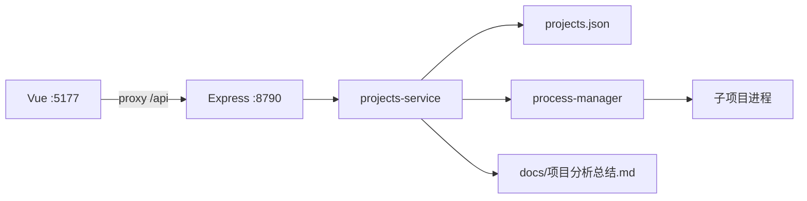

# LabHub · 项目分析总结

> 生成日期：2026-09-03
> 分析根目录：`E:\Desktop\TYX\AI\labhub`
> 说明：基于仓库内文件与脚本整理；推断处已标明。

## 1. 一句话定位

LabHub 是本机**多 Git 仓库控制中枢**：按地址拉取/挂载项目，统一启停与日志监控，并在控制台阅读各仓的《项目分析总结》；子项目仍用各自 `origin` 提交推送。

## 2. 项目概览

| 项 | 内容 |
|---|---|
| 类型 | npm workspaces 全栈（管理 API + Vue 控制台） |
| 主要语言 | TypeScript |
| 包管理器 | npm（workspaces + `package-lock.json`） |
| 当前分支 / 版本线索 | `main`；根包 `0.1.0` |
| 许可证 | 未在仓库体现 |

### 2.1 目标与范围

- 要解决的问题：在一台机器上统管多个独立 Git 项目，避免把「中枢」嵌进某个业务仓内部。
- 明确不做的事：不替代子项目 git 工作流；不做云端托管/多租户；默认无鉴权（仅适合受信本机）。

### 2.2 使用者与场景

- 目标用户：本机开发者、实验环境维护者。
- 典型场景：登记 freellmapi / edgetunnel 等仓 → 控制台启停 → 看日志与运行地址 → 读分析总结。

## 3. 我能用这个项目做什么

| # | 我可以… | 得到的结果 | 依据 |
|---|---|---|---|
| 1 | 粘贴 GitHub/Gitee 地址添加仓库 | 浅克隆到 `projects/<id>/` 并写入清单 | `POST /api/projects`、`projects-service.ts` |
| 2 | 在控制台一键启动/停止子项目 | 子进程在项目目录执行启动命令，可看 PID/状态 | `process-manager.ts`、控制台启停按钮 |
| 3 | 查看运行日志与探测到的访问地址 | 知道服务是否起来、打开哪个 URL | 日志页签、`openUrl`/`runtimeUrls` |
| 4 | 阅读每个托管项目的分析总结 | 了解「能做什么 / 怎么做」而不用翻源码 | `docs/项目分析总结.md`、`GET .../analysis` |
| 5 | 同步 origin（快进拉取） | 把本地托管克隆更新到远端最新（ff-only） | `POST /api/projects/:id/sync` |
| 6 | 挂载已有本地目录而不重复克隆 | 登记绝对路径项目进同一控制台 | `addProject` 的 `localPath` |

### 3.1 适合谁用 / 不适合做什么

- 适合：本机同时维护多个实验仓、需要统一看门狗式启停与文档入口。
- 不适合：公网暴露、多用户权限隔离、替代 IDE/CI；`startCommand` 等价本机任意命令，切勿对不可信网络开放。

### 3.2 与周边系统如何配合

- 被管项目落在 `projects/`（gitignore）或挂载路径；各自独立 `.git`。
- 当前演示：`projects/freellmapi`、`projects/edgetunnel`；分析文档在各仓 `docs/项目分析总结.md`。

## 4. 具体实施步骤

### 场景 A：本地跑通 LabHub 控制台

1. 前置：Node.js ≥ 20.18、本机已装 `git`。
2. 安装：
   ```bash
   cd E:\Desktop\TYX\AI\labhub
   npm install
   ```
3. （可选）登记演示项目：
   ```bash
   npm run seed:demo
   ```
4. 启动：
   ```bash
   npm run dev
   ```
5. 验证：浏览器打开 http://127.0.0.1:5177 ；页面应出现项目列表。API 健康检查：http://127.0.0.1:8790/api/health 。

### 场景 B：在控制台启动 FreeLLMAPI 并打开其页面

1. 确认清单中有 `freellmapi`（否则先跑场景 A 的 `seed:demo`，或控制台「添加仓库」）。
2. 打开 LabHub http://127.0.0.1:5177 ，左侧点 FreeLLMAPI → 点「启动」。
3. 等状态变为「运行中」；「运行地址」出现 `http://127.0.0.1:5173`（及日志探测到的端口）。
4. 验证：浏览器打开 http://127.0.0.1:5173 （FreeLLMAPI 仪表盘）；API 默认另见 `:3001`。
5. 右侧切到「分析总结」或点左侧「查看分析总结 →」，应渲染 Markdown 正文。

### 场景 C：用 curl 添加一个新仓库

1. 确保 LabHub API 已启动（`:8790`）。
2. 执行：
   ```bash
   curl -X POST http://127.0.0.1:8790/api/projects \
     -H "Content-Type: application/json" \
     -d "{\"repoUrl\":\"https://github.com/你的账号/某项目.git\",\"startCommand\":\"npm run dev\",\"openUrl\":\"http://127.0.0.1:5173\"}"
   ```
3. 验证：控制台列表出现新项目；磁盘出现 `projects/<仓库名>/`。
4. 在该目录按该项目自己的 README 配置后，再在控制台点启动。

### 场景 D：给某托管项目补分析总结并在平台查看

1. 在目标项目根创建 `docs/项目分析总结.md`（可用 project-analysis-summary skill 生成）。
2. 刷新 LabHub；左侧应出现「查看分析总结 →」。
3. 验证：`GET http://127.0.0.1:8790/api/projects/<id>/analysis` 返回 `exists: true`；控制台「分析总结」页签有正文。

## 5. 技术栈

| 层级 | 选型 | 依据（文件） |
|---|---|---|
| 运行时 / 语言 | Node ≥ 20.18、TypeScript | 根 `package.json` |
| 后端 | Express 5、cors、zod | `server/package.json` |
| 前端 | Vue 3、Vite 6、marked | `client/package.json` |
| UI | Tailwind CSS 4 | `client/vite.config.ts` |
| 数据 | `data/projects.json`；运行态 `data/runtime.json` + 端口探测 | `store.ts`、`runtime-store.ts`、`process-probe.ts` |
| 工程化 | npm workspaces、tsx、concurrently | 根 `package.json` |

## 6. 架构与目录

### 6.1 逻辑架构



### 6.2 顶层目录职责

| 路径 | 职责 |
|---|---|
| `server/` | 管理 API、进程、git、分析文档读取 |
| `client/` | Vue 控制台 |
| `projects/` | 托管克隆（不入库） |
| `data/` | 清单与运行态（不入库） |
| `docs/` | LabHub 自身分析总结 |

## 7. 核心模块

| 模块 | 职责 | 关键路径 |
|---|---|---|
| 项目服务 | 增删改、克隆、启停、sync | `server/src/projects-service.ts` |
| 进程管理 | 启停、日志、PID 持久化、端口校正状态 | `server/src/process-manager.ts` |
| 分析文档 | 读取各仓 `docs/项目分析总结.md` | `server/src/analysis.ts` |
| 控制台 | 列表、启停、日志/分析页签 | `client/src/App.vue` |

## 8. 入口与关键流程

### 8.1 应用入口

- 进程：`server/src/index.ts`（默认端口 **8790**）
- 前端：`client/src/main.ts` → `App.vue`（开发 **5177**，代理到 8790）

### 8.2 主流程

**流程 A：查看分析总结** — 选中项目 → `GET /api/projects/:id/analysis` → marked 渲染。  
**流程 B：启动项目** — `POST .../start` → spawn `startCommand` → 写 `runtime.json` → 端口探测校正「运行中」。

## 9. API 与数据

| 方法 | 路径 | 说明 |
|---|---|---|
| GET | `/api/health` | 健康检查 |
| GET | `/api/projects` | 列表（含 `hasAnalysis`、`runtimeUrls`） |
| GET | `/api/projects/:id/analysis` | 分析总结 Markdown |
| POST | `/api/projects/:id/start\|stop\|sync` | 启停与同步 |

鉴权：**无**（本机受信环境）。

## 10. 配置与运行

| 变量名 | 用途 | 是否必需 |
|---|---|---|
| `PORT` | API 端口，默认 `8790`（避开 wrangler 默认 8787） | 否 |

```bash
npm install
npm run seed:demo   # 可选
npm run dev         # API :8790 + 控制台 :5177
```

| 命令 | 作用 |
|---|---|
| `npm run dev` | 同时开发前后端 |
| `npm run build` / `npm start` | 构建并由 Express 托管静态控制台 |
| `npm run seed:demo` | 登记 freellmapi / edgetunnel |

## 11. 工程约定

- camelCase；中文 JSDoc；提交建议 Conventional Commits（中文）。
- `projects/*`、`data/` 不进入 LabHub git。

## 12. 风险、债与未知

- 无鉴权 + `shell: true` 执行启动命令 → 仅本机使用。
- 状态靠 PID 持久化 + 端口探测；外部进程可能显示运行中但无法被 LabHub 干净杀掉。
- EdgeTunnel 须用非 8790 端口（登记为 8788），避免与 LabHub API 冲突。

## 13. 新人上手路径

1. 读本文件第 3～4 节 → 跑「场景 A」。
2. 跑「场景 B」启动 freellmapi 并打开分析总结。
3. 小改：`client/src/App.vue` 文案，或 `server/src/app.ts` 的 `/api/health`。

## 14. 参考文件索引

| 主题 | 路径 |
|---|---|
| README | `README.md` |
| 服务入口 | `server/src/index.ts` |
| 项目服务 | `server/src/projects-service.ts` |
| 分析读取 | `server/src/analysis.ts` |
| 控制台 | `client/src/App.vue` |
| 本总结 | `docs/项目分析总结.md` |
