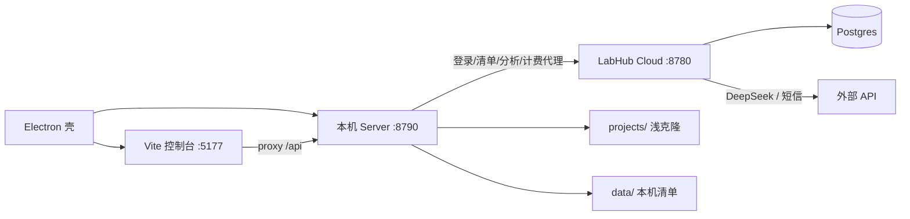

# LabHub · 项目分析总结

> 生成日期：2026-10-08
> 分析根目录：`E:\Desktop\TYX\AI\labhub`
> 说明：基于仓库内文件与脚本整理；推断处已标明。已对照当前 `main`（`pnpm@10.30.1`、Cloud/Electron 形态）复核，并同步本机 `projects/` 与 `config/public.json`。

## 1. 一句话定位

LabHub 是本机**多 Git 仓库控制中枢**：按地址浅克隆/挂载项目，按启动模式分端启停与看日志，经 Cloud 做手机号登录、清单同步、套餐额度与 AI 项目分析；子项目仍用各自 `origin` 提交推送。

## 2. 项目概览

| 项 | 内容 |
|---|---|
| 类型 | pnpm workspace 全栈（本机 API + Vue 控制台 + Electron 壳 + Cloud 服务） |
| 主要语言 | TypeScript |
| 包管理器 | **pnpm**（`packageManager: pnpm@10.30.1`，`pnpm-lock.yaml`） |
| 安装依赖 | `pnpm install` |
| 默认启动 | `pnpm dev`（server `:8790` + client `:5177` + cloud `:8780` + Electron） |
| 当前分支 / 版本线索 | `main`；根包 `0.1.0` |
| 许可证 | 未在仓库体现 |

### 2.1 目标与范围

- 要解决的问题：在一台机器上统管多个独立 Git 项目，统一启停/日志/分析入口，避免把「中枢」嵌进某个业务仓内部。
- 明确不做的事：不替代子项目自己的 git 远程；Cloud **只存清单元数据，不上传源码**；发给用户的是 Electron 安装包，Cloud 只部署在维护者服务器；`services/analysis-relay` 为遗留服务，默认不随 `pnpm dev` 启动。

### 2.2 使用者与场景

- 目标用户：本机同时维护多仓的开发者；安装包终端用户（登录后管理本机克隆）；Cloud 维护者（部署账号/支付/AI）。
- 典型场景：登记仓库 → 多端启动/构建/自定义命令 → 看日志与运行地址 → 读 AI/启发式分析总结 → 换机后按云端清单恢复克隆。

## 3. 我能用这个项目做什么

> 本节回答：作为使用者，跑起来之后能得到什么结果。每条写「可以……从而……」。

| # | 我可以… | 得到的结果 | 依据（功能/路由/脚本） |
|---|---|---|---|
| 1 | 粘贴 GitHub/Gitee 地址添加仓库 | 浅克隆到 `projects/<id>/` 并写入本机清单 | `POST /api/projects`、`projects-service.ts` |
| 2 | 挂载已有本地目录（不重复克隆） | 同一控制台管理绝对路径项目 | `addProject` / 控制台「添加仓库」的本地路径 |
| 3 | 按「启动模式」分端启停，并可改运行端口 | 多进程并行、各有 PID/状态/日志与探测 URL | `startProfiles`、`runPort`、`POST .../start\|stop` |
| 4 | 安装依赖、按构建目标 build、跑自定义命令 | 在控制台完成装包/构建/临时 shell | `POST .../install`、`.../build`、`.../run`、`custom-commands` |
| 5 | 手机号注册/登录（密码或验证码），并用邀请码加额度 | 账号绑定本机清单；默认可管 3 个项目 | Cloud `/v1/auth/*`、本机 `/api/auth/*` |
| 6 | 首次托管时走 Cloud AI 分析（有配额） | 得到各仓 `docs/项目分析总结.md`；Key 只在 Cloud | `POST /v1/analyze`、本地 `/api/projects/:id/analysis*` |
| 7 | 在控制台做清单同步、从云端恢复缺失仓、Git 提交/stash/合并/切分支 | 换机可恢复元数据并再浅克隆；日常 Git 不必离开控制台 | `/api/auth/*catalog*`、`/restore*`、`.../commit\|stash\|merge\|checkout` |
| 8 | 购买/切换套餐（开发为 mock 支付）或打 Windows 安装包 | 提高项目位与 AI 次数；把桌面端发给用户 | `/api/billing/*`、`pnpm package:win`、`electron-builder.yml` |

### 3.1 适合谁用 / 不适合做什么

- 适合：本机同时维护多个实验/客户仓；需要「多端分模式」启停与统一日志；需要云端账号与额度控制。
- 不适合 / 未实现：把本机 API 暴露到公网（`startCommand` 等价任意 shell）；真实支付渠道（`PAYMENT_MODE=live` 仅预留）；用 Cloud 存源码或替代各仓 CI。

### 3.2 与周边系统如何配合

- 被管项目落在 `projects/`（gitignore）或绝对路径；各自独立 `.git`，`git push origin` 仍回源仓库。
- 本机数据：`data/projects.json`、登录态等（gitignore）；安装包默认数据根见 Electron（`%LOCALAPPDATA%\LabHubData`，可由安装时指针/注册表覆盖）。
- Cloud 公网地址写在可公开的 `config/public.json` 的 `cloudUrl`（可用环境变量 `LABHUB_CLOUD_URL` 覆盖）。当前仓库值为 `https://labhubcloud.yxtao.site`；本地一体开发时 `pnpm dev` 仍会起本机 Cloud `:8780`，可用 `LABHUB_CLOUD_URL=http://127.0.0.1:8780` 覆盖。
- Cursor 工作区：`labhub.code-workspace` 多为根工作区 + 各托管仓多根；`server` 启动时会尝试同步该文件。
- 当前本机 `projects/` 可见托管项：`douxing`、`edgetunnel`、`ezshell`、`freellmapi`、`multiuserclaw`、`navigation`、`official-website`、`safetymanagement`、`zj-steel-pipe`，以及指向外部目录的 `zhonglao-project` 符号链接。

## 4. 具体实施步骤

> 每个场景可照做：前置 → 安装配置 → 启动 → 验证。命令以锁文件为准，使用 **pnpm**。

### 场景 A：本地跑通控制台（一体开发）

1. 前置：Node.js ≥ 20.18；本机已装 Git；已安装并启动 [Docker Desktop](https://www.docker.com/products/docker-desktop/)（Cloud 依赖 Postgres `:5433`）。
2. 安装：
   ```bash
   cd E:\Desktop\TYX\AI\labhub
   corepack prepare pnpm@10.30.1 --activate
   pnpm install
   ```
3. 启动（会自动补 `services/cloud/.env`、`docker compose` 拉起 Postgres，并并发起 server/client/cloud/Electron）：
   ```bash
   pnpm dev
   ```
4. 验证：
   - 浏览器或 Electron 打开 http://127.0.0.1:5177
   - `curl http://127.0.0.1:8790/api/health` 应返回 `"ok":true`
   - Cloud：`curl http://127.0.0.1:8780/health`
5. 开发账号（`SMS_PROVIDER=dev`）：手机号 `13800138000` / 密码 `labhub123`；短信固定码默认见 Cloud `.env.example` 的 `SMS_DEV_CODE=123456`。

### 场景 B：添加一个远程仓库并按模式启动

1. 前置：已完成场景 A，且已登录（项目 API 需本机登录态）。
2. 控制台点「添加仓库」，或：
   ```bash
   curl -X POST http://127.0.0.1:8790/api/projects \
     -H "Content-Type: application/json" \
     -H "Cookie: <本机登录后的会话>" \
     -d "{\"repoUrl\":\"https://github.com/你的账号/某项目.git\",\"startCommand\":\"pnpm run dev\"}"
   ```
   （控制台操作更省事；curl 需带上登录后的会话信息。）
3. 在项目卡片选择某个启动模式 →「启动」；需要时在模式上配置 `runPort` 避免端口冲突。
4. 验证：状态为 running；日志面板有输出；若探测到 URL，可一键打开。
5. 在源仓目录提交仍推回该仓远端：
   ```bash
   cd projects/某项目
   git add .
   git commit -m "feat(scope): 中文概述"
   git push origin HEAD
   ```

### 场景 C：单独部署 / 发布 Cloud（维护者）

1. 前置：服务器有 Docker、Node、PM2；已配置 `services/cloud/.env`（必填 `JWT_SECRET`、`DATABASE_URL`；生产还需 `DEEPSEEK_API_KEY`、阿里云短信相关变量）。
2. 仓库根执行：
   ```bash
   pnpm release
   ```
3. 或推送 `services/cloud/**` 等到 `main`，由 GitHub Actions **Release Cloud** 经 SSH/`rsync` 同步并执行 `pnpm release`（Secrets：`DEPLOY_HOST`、`DEPLOY_USER`、`DEPLOY_SSH_KEY` 等）。
4. 验证：公网 `https://你的域名/health`；把地址写入本仓 `config/public.json` 的 `cloudUrl`。
5. 套餐：控制台「套餐」内开通；开发默认 `PAYMENT_MODE=mock`。档位见 `services/cloud/src/plans.ts`（免费 3 仓 / 基础 ¥9.9·10 仓 / 专业 ¥29·30 仓）。

### 场景 D（可选）：打 Windows 安装包

1. 将 `config/public.json` 的 `cloudUrl` 改为正式 Cloud 地址（不要用 `127.0.0.1`）。
2. 仓库根：`pnpm package:win`
3. 产物：`release/electron/LabHub-Setup-0.1.0.exe`
4. 验证：安装后双击 LabHub，窗口内登录；清单与克隆在用户数据目录（默认 `%LOCALAPPDATA%\LabHubData`）。用户机需已装 Git。

## 5. 技术栈

| 层级 | 选型 | 依据（文件） |
|---|---|---|
| 运行时 / 语言 | Node ≥ 20.18、TypeScript | 根/各包 `package.json`、`engines` |
| 本机 API | Express 5、Zod、cors | `server/package.json` |
| 控制台 UI | Vue 3、Vite 6、Tailwind CSS 4、marked | `client/package.json`、`vite.config.ts` |
| 桌面壳 | Electron 44、electron-builder | 根 `package.json`、`desktop/main.mjs`、`electron-builder.yml` |
| Cloud | Express 5、jose（JWT）、pg（PostgreSQL）、Zod | `services/cloud/package.json` |
| 数据 | 本机 JSON 清单；Cloud 用 Postgres（Docker `:5433`） | `server/src/store.ts`、`docker-compose.yml` |
| AI | DeepSeek（仅 Cloud 持有 Key；本机可直连仅维护者调试） | `services/cloud/.env.example`、根 `.env.example` |
| 短信 | 开发 `dev` / 生产阿里云 | `services/cloud/src/sms.ts` |
| 工程化 | pnpm workspace、concurrently、tsx、GitHub Actions | `pnpm-workspace.yaml`、`.github/workflows/*` |
| 测试 | 仓库内未见系统化单测脚本 | 未体现 |

## 6. 架构与目录

### 6.1 逻辑架构


```mermaid
flowchart LR
  Electron[Electron 壳]
  Vite[Vite 控制台 :5177]
  Server[本机 Server :8790]
  Cloud[LabHub Cloud :8780]
  PG[(Postgres)]
  Projects[projects/ 浅克隆]
  Data[data/ 本机清单]

  Electron --> Vite
  Electron --> Server
  Vite -->|proxy /api| Server
  Server --> Projects
  Server --> Data
  Server -->|登录/清单/分析/计费代理| Cloud
  Cloud --> PG
  Cloud -->|DeepSeek / 短信| Ext[外部 API]
```

### 6.2 顶层目录职责

| 路径 | 职责 |
|---|---|
| `server/` | 本机管理 API：项目启停、Git、分析、鉴权代理 |
| `client/` | Vue 控制台（开发态 Vite `:5177`） |
| `desktop/` | Electron 主进程与 preload |
| `services/cloud/` | 账号、清单同步、配额、AI、计费 |
| `services/analysis-relay/` | 遗留可选中继（默认不启，端口曾与 Cloud 冲突） |
| `config/public.json` | 可公开 `cloudUrl`、`labhubRepoUrl` |
| `projects/` | 托管克隆（gitignore） |
| `data/` | 本机清单与登录态（gitignore） |
| `scripts/` | 开发基建、打安装包、发布 Cloud |
| `docs/` | 分析总结、商业化与获客材料 |
| `build/`、`release/` | 安装包资源与产物 |

### 6.3 Workspace 子包

| 包名 | 路径 | 职责 |
|---|---|---|
| `@labhub/server` | `server/` | 本机 API |
| `@labhub/client` | `client/` | 控制台 UI |
| `@labhub/cloud` | `services/cloud/` | 云端服务 |

## 7. 核心模块

| 模块 | 职责 | 关键路径 |
|---|---|---|
| 应用装配与路由 | Express 挂载 auth/billing/categories/projects/workspace | `server/src/app.ts`、`routes/*` |
| 项目服务 | 克隆、挂载、启停、安装构建、模式补全 | `projects-service.ts`、`process-manager.ts` |
| 启动/构建模式 | 从 package.json / Python 等推断多端 profile | `profiles.ts`、`package-profiles.ts`、`python-profiles.ts` |
| 运行态与日志 | PID、状态、日志缓冲、端口探测 URL | `runtime-store.ts`、`process-probe.ts`、`run-port.ts` |
| 分析总结 | 启发式补全 + Cloud AI / 本机 DeepSeek 调试 | `analysis*.ts` |
| Cloud 客户端 | 登录态、清单推拉、分析与计费转发 | `cloud-client.ts`、`auth-store.ts`、`catalog-sync.ts` |
| 路径与打包 | 开发根 vs 安装包资源/用户数据根 | `app-paths.ts`、`desktop/main.mjs` |
| Cloud 业务 | 短信鉴权、配额、DeepSeek、套餐订单 | `services/cloud/src/*` |
| 控制台 | 单文件大视图：登录、列表、启停、Git、套餐 | `client/src/App.vue` |

## 8. 入口与关键流程

### 8.1 应用入口

- 本机进程：`server/src/index.ts`（`PORT` 默认 8790）
- 控制台：`client/src/main.ts` → `App.vue`；开发代理 `/api` → `:8790`
- Electron：根 `package.json` 的 `"main": "desktop/main.mjs"`
- Cloud：`services/cloud/src/index.ts`（默认 8780）

### 8.2 主流程

**流程 A：添加仓库并首次分析**

1. 用户登录 → 本机保存 Cloud JWT/会话
2. `POST /api/projects` 浅克隆到 `projects/<id>/`，写入 `data/projects.json`
3. 若已登录且有 AI 配额：经 Cloud `POST /v1/analyze` 生成分析文档；否则启发式本地生成
4. 清单元数据可同步到 Cloud `PUT /v1/catalog`（不含源码）

**流程 B：按模式启停**

1. 控制台选择 `profileId` → `POST /api/projects/:id/start`
2. `process-manager` 在项目 cwd 执行命令；可选注入 `runPort`
3. 运行态写入内存/runtime；日志可读；探测 `runtimeUrls`
4. `POST .../stop` 结束对应进程

**流程 C：`pnpm dev` 一体启动**

1. `scripts/ensure-cloud-dev.mjs` 补 `.env`、起 Postgres、等 `:5433`
2. concurrently 启动 server、client、cloud、`electron .`
3. Electron 开发态加载 `http://127.0.0.1:5177/`

## 9. API 与数据

### 9.1 本机主要接口（节选）

| 方法 | 路径 | 说明 |
|---|---|---|
| GET | `/api/health` | 健康检查（无需登录） |
| * | `/api/auth/*` | 短信/注册/登录/登出/改密/清单推拉/恢复克隆 |
| * | `/api/billing/*` | 套餐目录、下单、支付、切免费 |
| * | `/api/categories/*` | 侧栏分类 CRUD（需登录） |
| * | `/api/projects/*` | 项目 CRUD、启停、装包/构建/自定义命令、Git、日志、分析 |
| * | `/api/workspace/*` | 打开工作区、数据目录查询与迁移 |

### 9.2 Cloud 主要接口

| 方法 | 路径 | 说明 |
|---|---|---|
| POST | `/v1/auth/sms/send` 等 | 短信、注册、登录、改密、`/me` |
| GET/PUT | `/v1/catalog` | 用户项目元数据清单 |
| POST | `/v1/analyze` | 扣配额后返回 markdown |
| * | `/v1/billing/*` | 套餐与 mock/预留支付 |

### 9.3 核心数据模型

| 实体 | 说明 | 关键位置 |
|---|---|---|
| `ProjectRecord` | 托管项目：路径、命令、profiles、分期、分类 | `server/src/types.ts`、`data/projects.json` |
| `StartProfile` / `BuildProfile` / `CustomCommand` | 多端启动、构建、自定义命令 | 同上 |
| `CategoryRecord` | 侧栏分组 | 同上 |
| Cloud 用户/订单/配额 | 手机号账号、套餐、AI 月配额 | Postgres（Cloud 启动自动建表） |

### 9.4 外部依赖与集成

| 服务 | 用途 | 配置项（变量名） |
|---|---|---|
| DeepSeek | AI 项目分析 | `DEEPSEEK_API_KEY`（Cloud；本机可选调试） |
| 阿里云短信 | 生产验证码 | `SMS_ACCESS_KEY_*`、`SMS_SIGN_NAME`、`SMS_TEMPLATE_CODE` 等 |
| Postgres | Cloud 持久化 | `DATABASE_URL` |
| GitHub Actions | 发布 Cloud、打 Windows 包 | `DEPLOY_*` Secrets |

## 10. 配置与运行

### 10.1 环境变量（仅名称与用途）

| 变量名 | 用途 | 是否必需 |
|---|---|---|
| `PORT` | 本机 server 端口（默认 8790） | 否 |
| `LABHUB_CLOUD_URL` | 覆盖 `config/public.json` 的 Cloud 地址 | 否 |
| `DEEPSEEK_API_KEY` | 本机直连 DeepSeek（仅维护者调试） | 否 |
| `JWT_SECRET` | Cloud JWT | Cloud 必需 |
| `DATABASE_URL` | Cloud Postgres | Cloud 必需 |
| `SMS_PROVIDER` / `SMS_DEV_CODE` | 短信模式与开发固定码 | 开发建议 |
| `PAYMENT_MODE` | `mock` / `live` | 开发默认 mock |
| `DEFAULT_PROJECT_LIMIT` | 默认项目额度 | 否 |
| `LABHUB_PACKAGED` / `LABHUB_APP_ROOT` 等 | 安装包路径（Electron 注入） | 打包运行时 |

### 10.2 本地启动

```bash
corepack prepare pnpm@10.30.1 --activate
pnpm install
pnpm dev
```

### 10.3 常用脚本

| 命令 | 作用 |
|---|---|
| `pnpm dev` | 基建 + server/client/cloud/Electron |
| `pnpm build` | 构建 client + server |
| `pnpm start` | 仅启动已构建的 server |
| `pnpm seed:demo` | 登记演示项目（server 脚本） |
| `pnpm package:win` | 打 Windows 安装包 |
| `pnpm release` | 服务器侧发布 Cloud（Docker + PM2） |

### 10.4 测试与 CI

- 测试：未见统一 `test` 脚本。
- CI：`.github/workflows/release-cloud.yml`（Cloud 发布）；`.github/workflows/package-win.yml`（Windows 安装包 / Release）。

### 10.5 部署线索

- Cloud：本机 `pnpm release` 或 Actions `rsync` + 远程 `pnpm release`；PM2 进程名 `labhub-cloud`。
- 桌面端：`pnpm package:win` → NSIS 安装包；不含 Cloud、不含源码仓库本体。

## 11. 工程约定

- 代码组织：pnpm workspace；server/cloud 用 ESM + tsx；client 为 Vue SFC（当前以 `App.vue` 单体为主）。
- 命名：业务侧倾向 camelCase；常量 UPPER_SNAKE_CASE（工作区规则）。
- Git / 提交：Conventional Commits，**subject 用简体中文**（见根 `.cursorrules` 与 `.cursor/rules/git-commit-chinese.mdc`）。
- 安全：密钥只进 `.env`（gitignore）；`config/public.json` 仅公开 URL。

## 12. 风险、债与未知

- **任意命令执行**：启动/构建/自定义命令在本机 shell 执行，仅适合受信环境，勿对公网开放 `:8790`。
- **端口冲突**：多托管仓常共用 `3000`/`5173` 等；依赖 `runPort` 或只启一端。
- **控制台体量**：`client/src/App.vue` 超大，后续改动易冲突，可考虑拆组件（技术债）。
- **支付**：生产 `PAYMENT_MODE=live` 真实渠道未在仓库完整落地。
- **analysis-relay**：遗留，易与 Cloud 争 `:8780`，默认勿启。
- **文档路径**：README 写安装包数据在 `%LOCALAPPDATA%\LabHub`，Electron 默认解析为 `LabHubData`；以安装时选定目录 / 注册表为准。
- 仓库中未能确认：正式许可证、系统化自动化测试覆盖范围。

## 13. 新人上手路径

1. 阅读：根 `README.md`、本文、`services/cloud/README.md`。
2. 先完成「场景 A」：`pnpm install` → `pnpm dev` → 用开发账号登录控制台。
3. 用「添加仓库」挂一个小仓，配置一个启动模式并看日志。
4. 小改动建议：改 `client/src/App.vue` 某一文案或 `server/src/routes/projects.ts` 某响应字段，热重载验证。
5. 若做 Cloud 运维：再读场景 C 与 GitHub Secrets 配置。

## 14. 参考文件索引

| 主题 | 路径 |
|---|---|
| README | `README.md` |
| 包清单 / 锁文件 | `package.json`、`pnpm-workspace.yaml`、`pnpm-lock.yaml` |
| 本机入口 | `server/src/index.ts`、`server/src/app.ts` |
| 控制台 | `client/src/App.vue`、`client/vite.config.ts` |
| Electron | `desktop/main.mjs`、`electron-builder.yml` |
| Cloud | `services/cloud/README.md`、`services/cloud/src/index.ts` |
| 公开配置 | `config/public.json` |
| 环境样例 | `.env.example`、`services/cloud/.env.example` |
| 发布脚本 | `scripts/ensure-cloud-dev.mjs`、`scripts/release-cloud.mjs`、`scripts/package-electron.mjs` |
